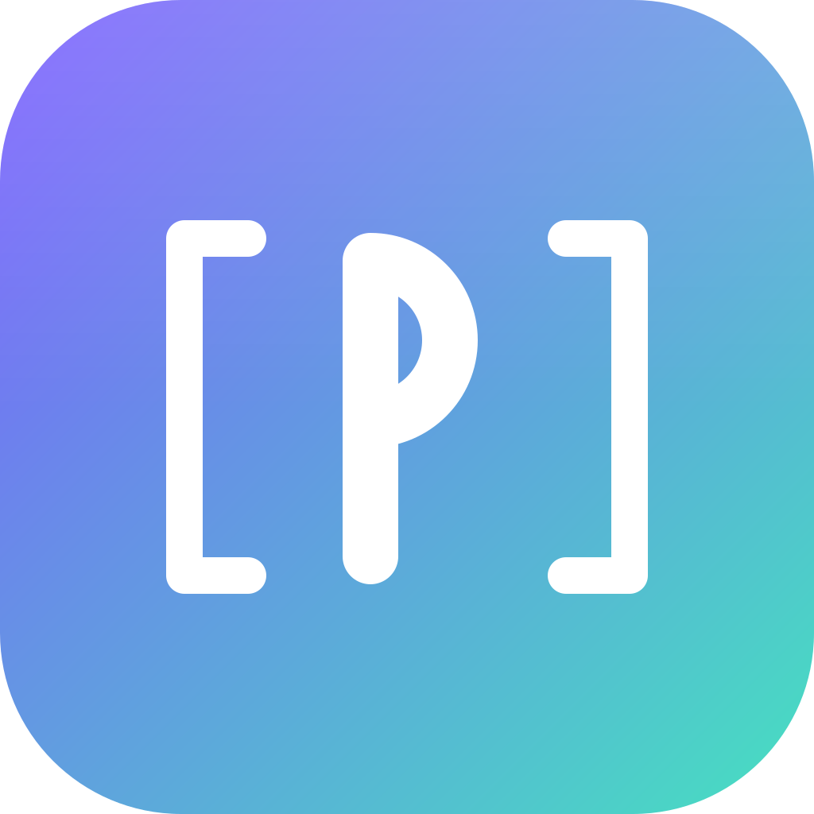
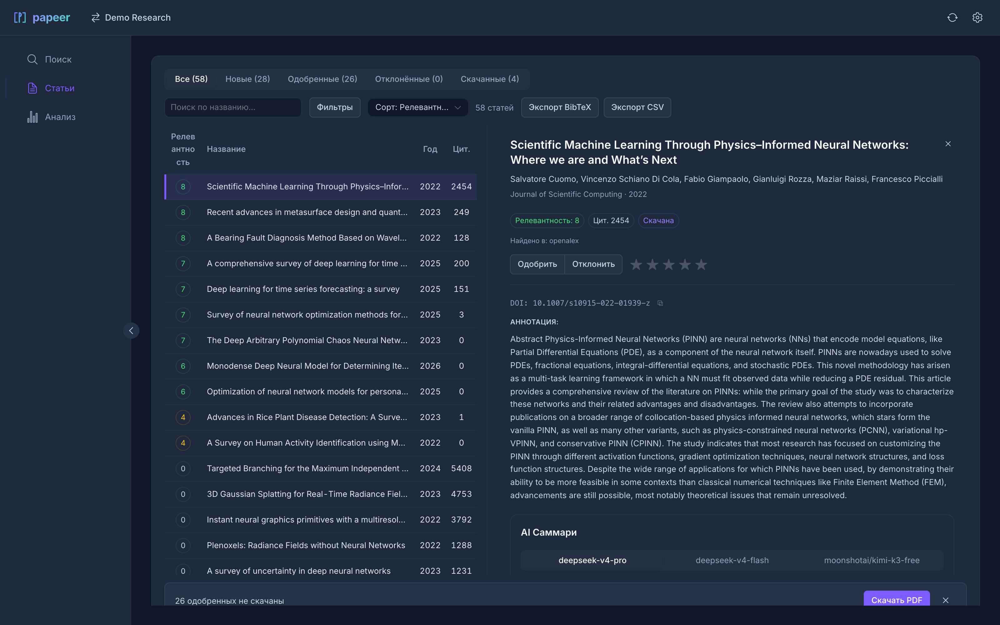
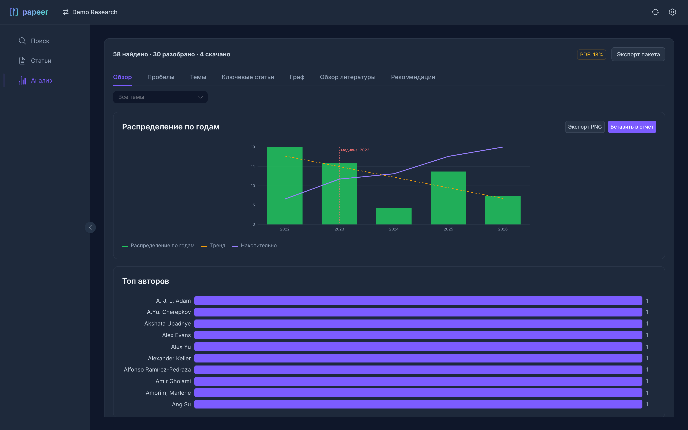

<div align="center">



# Papeer

**Десктоп-приложение для обзора научной литературы.**
Поиск сразу в четырёх базах, скоринг релевантности, быстрый разбор с клавиатуры,
скачивание PDF, экспорт BibTeX/CSV и локальная аналитика поля — на вашем компьютере, без аккаунтов.

[](https://github.com/qnqatop/papeer/releases)
[](LICENSE)
[](https://github.com/qnqatop/papeer/releases)
[](https://go.dev)
[](https://wails.io)

[Скачать](https://github.com/qnqatop/papeer/releases) · [Сайт](https://papeer.store) · [English](#english)

</div>

---

## Что это

Papeer автоматизирует рутину систематического обзора литературы: находит статьи, отсекает
нерелевантное, качает полные тексты и готовит библиографию — то, что обычно делается вручную
через десятки вкладок браузера.

Приложение нативное (Go + [Wails](https://wails.io) + Vue 3), работает на macOS, Windows и Linux.
База статей, профили и настройки лежат локально в SQLite; аккаунтов и телеметрии нет.

## Возможности

- **Поиск в 4 базах одним запросом** — OpenAlex, Crossref, Semantic Scholar, arXiv. Запросы идут
  параллельно, дубли сливаются по DOI (а без него — по нормализованному заголовку).
- **Скоринг релевантности 0–10** — эвристика по вашим `must`/`boost`-ключам задаёт порядок разбора.
- **Быстрый разбор с клавиатуры** — `j`/`k` навигация, `a` одобрить, `r` отклонить, `Enter` детали.
- **Скачивание PDF из открытых источников** — цепочка arXiv → Semantic Scholar → OpenAlex →
  Unpaywall → Crossref, плюс headless Chrome для издателей с антибот-защитой (MDPI, Springer,
  ScienceDirect). Chrome опционален — без него источник просто пропускается.
- **Экспорт** — BibTeX и CSV в один клик; импорт/экспорт тем в YAML.
- **Аналитика поля** («Анализ») — распределения и статистика, кластеризация тем (TF-IDF + K-Means,
  локально), ключевые работы, пробелы покрытия, граф цитирований и рекомендации.
- **LLM-функции (опционально, на вашем ключе)** — краткие саммари статей и черновик обзора в
  Markdown. Работают с любым OpenAI-совместимым эндпоинтом (DeepSeek, OpenAI, локальная модель).
- **Мониторинг** — периодическая проверка тем на новые публикации.

> Поиск, скоринг, скачивание PDF, экспорт и локальная аналитика работают **без API-ключа**.
> Ключ нужен только для LLM-функций (саммари и черновик обзора).

## Скриншоты

|  |  |
|---|---|
|  |  |
| **Статьи** — список со скором и статусами + панель детали | **Анализ** — статистика, темы, граф цитирований |

## Установка

Готовые сборки — на странице [**Releases**](https://github.com/qnqatop/papeer/releases):

| Платформа | Файл | Примечание |
|---|---|---|
| macOS | `papeer-macos-universal.zip` | Universal (Intel + Apple Silicon) |
| Windows | `papeer-windows-amd64.zip` | Portable — распакуйте и запустите `papeer.exe` |
| Linux | `papeer-linux-amd64.tar.gz` | Нужен WebKitGTK (см. ниже) |

<details>
<summary>macOS — приложение не подписано</summary>

Сборка без сертификата Apple Developer, поэтому Gatekeeper блокирует первый запуск. После
распаковки в `/Applications` выполните один раз:

```bash
xattr -cr /Applications/Papeer.app
```
</details>

<details>
<summary>Linux — зависимость WebKitGTK</summary>

```bash
# Ubuntu/Debian
sudo apt install libwebkit2gtk-4.1-dev
# Fedora
sudo dnf install webkit2gtk4.1-devel
# Arch
sudo pacman -S webkit2gtk-4.1
```
</details>

## Сборка из исходников

Требуется [Go 1.26+](https://go.dev/dl/), [Node.js 22+](https://nodejs.org/) и
[Wails CLI](https://wails.io/docs/gettingstarted/installation):

```bash
go install github.com/wailsapp/wails/v2/cmd/wails@latest
```

```bash
make dev       # dev-режим с hot reload
make test      # go test ./... + vitest во фронтенде
make mac       # macOS Universal (.app)
make windows   # Windows x64 (кросс-компиляция с macOS)
make linux     # Linux amd64 (в Docker, см. Dockerfile.linux)
```

Результат — в `build/bin/`. Версия проставляется из `git describe` (ldflags) и видна в
**Settings → About**.

## Данные и ключи

- **База и настройки** — локальный SQLite-файл `~/.papeer/papeer.db` (права `0600`). В сеть уходят
  только явно инициированные вами запросы: к академическим API, за PDF и, если вы включили
  LLM-функции, к вашему LLM-эндпоинту. Фоновой отправки, телеметрии и «облака» нет.
- **API-ключи LLM** — хранятся в **системном хранилище ключей ОС** (Keychain на macOS,
  Credential Manager на Windows, Secret Service/libsecret на Linux), а не в файле базы и не в
  открытом виде. Ключ уходит только на указанный вами эндпоинт при явном вызове.
- **E-mail** — при создании исследования требуется валидный контактный e-mail. Это не регистрация:
  академические API (OpenAlex, Crossref, Unpaywall) просят указывать контакт в запросах
  («вежливый пул») — с ним данные отдаются стабильнее. E-mail хранится локально.

<details>
<summary>Опционально: Chrome для издателей с антибот-защитой</summary>

Если установлен Chrome / Chromium / Edge / Brave, загрузчик запускает его в headless-режиме как
последний fallback для MDPI, Springer, ScienceDirect и подобных. Без браузера скачивание просто
переходит к следующему источнику. Путь к бинарю можно переопределить:
`CHROMEDP_CHROME_PATH=/path/to/chrome`.
</details>

## Импорт тем из YAML

Темы можно завести из YAML-файла (**Поиск → ⋯ → Импорт YAML**). Примеры — в
[`examples/`](examples/) (`pt-c-catalysts.yaml`, `recommender-systems.yaml`):

```yaml
axes:                       # можно и topics: — это синонимы
  my_topic:
    description: "О чём эта тема"
    year_min: 2018
    max_per_query: 25
    queries:
      - "search query one"
      - "search query two"
    keywords_must:          # AND-фильтр: должны встретиться
      - "required term"
    keywords_boost:         # повышают скор
      - "ranking term"
```

## Горячие клавиши (раздел «Статьи»)

| Клавиша | Действие |
|:---:|---|
| `j` / `↓` | Следующая статья |
| `k` / `↑` | Предыдущая статья |
| `a` | Одобрить / отменить |
| `r` | Отклонить / отменить |
| `Enter` | Открыть панель деталей |

## Стек

| Слой | Технологии |
|---|---|
| Бэкенд | Go 1.26 · `modernc.org/sqlite` (без CGO) · `chromedp` (опционально) |
| GUI | Wails v2.12 |
| Фронтенд | Vue 3 · TypeScript · Vite · Pinia · Naive UI · vue-i18n |
| Источники | OpenAlex · Crossref · Semantic Scholar · arXiv · Unpaywall |

## Вклад

Баги и идеи — в [Issues](https://github.com/qnqatop/papeer/issues), патчи — через Pull Request.
Перед PR прогоните `make test`.

## Лицензия

[MIT](LICENSE) © 2026 papeer

---

<a id="english"></a>

## English

**Papeer** is a free cross-platform desktop app that automates academic literature reviews:
parallel search across **OpenAlex, Crossref, Semantic Scholar and arXiv**, DOI/title
deduplication, heuristic relevance scoring **0–10**, keyboard-driven triage
(`j`/`k`/`a`/`r`/`Enter`), open-access PDF downloading (arXiv → Semantic Scholar → OpenAlex →
Unpaywall → Crossref, plus headless Chrome for anti-bot publishers), one-click **BibTeX/CSV**
export, and local field analysis (topics, key papers, coverage gaps, citation graph,
recommendations). Optional LLM features (article summaries and a review draft) run against any
OpenAI-compatible endpoint using **your own key**.

Everything is stored locally in **SQLite**; LLM keys live in the OS keychain. No accounts, no
background telemetry, no cloud. Built with Go + Wails + Vue 3. Free and open source (MIT).

```bash
# Build from source (Go 1.26+, Node 22+)
go install github.com/wailsapp/wails/v2/cmd/wails@latest
make dev        # or: make mac / make windows / make linux / make test
```

Downloads: [Releases](https://github.com/qnqatop/papeer/releases) — macOS · Windows · Linux.
